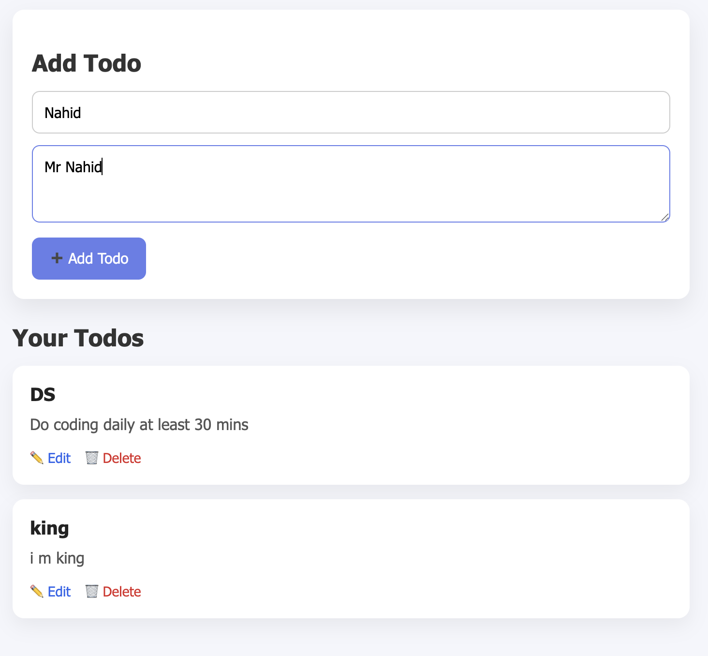

## Project 1 : MultiUser
# 📝 Django Todo App

A simple and clean **Todo Application** built with **Django** that supports:

- User Signup & Login
- Add, Edit & Delete Todos
- User-specific todo management
- Responsive & modern UI

Perfect for beginners learning Django authentication and CRUD operations.

## 🚀 Features

- 🔐 User Authentication (Signup / Login)
- 🧑‍💻 Each user sees only their own todos
- ➕ Add new todos
- ✏️ Edit existing todos
- 🗑️ Delete todos

## 🖼️ Screenshots

### 📋 Todo List Page



## 🛠️ Tech Stack

- **Backend:** Django (Python)
- **Frontend:** HTML, CSS
- **Database:** SQLite (default Django DB)
- **Authentication:** Django built-in User model


## Project 2 : DRF_Todo
# 📝 Django Rest Framework Todo App


## ⚠️ Important Warning (uv Required)

> This project uses **`uv`** instead of `pip`.

❌ Do **NOT** use:
```bash
pip install -r requirements.txt

## ✅ Always use uv:

uv sync
